## 1. Introduction
Hi there! Welcome to the User Guide for InternBuddy! We are here to help guide you on your journey with our application. **Keep on reading to become an InternBuddy Guru!**


### 1.1. What is InternBuddy?
InternBuddy is a **desktop application to help computer science students manage their events, companies, and contact people encountered during the internship search.** 

This application is optimized for use via a **Command Line Interface (CLI)** while still having the benefits of a **Graphical User Interface (GUI).** 

If you can type fast, InternBuddy can definitely help you organize your internship search faster than traditional GUI apps.


### 1.2. Purpose of The User Guide
The purpose of this User Guide is to assist you in learning and using InternBuddy. Whether you're a new user looking for a place to start or a veteran needing a quick reference, this guide is here to answer your questions.

<div markdown="span" class="alert alert-primary">:bulb: **Tip:**
If you have never used InternBuddy before, the [Quick Start](#2-quick-start) section is super useful for you to start!
</div>

### 1.3. InternBuddy Target Audience
InternBuddy is designed and optimised for **Computer Science Students who are looking to manage their internship**. However, if you are not a Computer Science Student, worry not! Our User Guide
is meant for anyone who wants to try and learn how to use InternBuddy. 

### 1.4. Helping Icons
Here are some icons that can help us emphasize any important information for you. Do read what it means beforehand!

| Icon                 | Meaning                                                                                           |
| -------------------- | ------------------------------------------------------------------------------------------------- |
| :information_source: | This icon indicates important information to be taken note of                                     |
| :bulb:               | This icon indicates useful tips for the users                                                     |
| :exclamation:        | This icon indicates caution for an action the user can take that can have dangerous consequences. |

### 1.5. Table of Contents
* Table of Contents
{:toc}


---

## 2. Quick start

If you're interested in using InternBuddy but don't know where to begin, this section will give you a step-by-step walkthrough to get you started!

1. Ensure you have Java `11` or above installed in your Computer.

    - If you don't have it installed, you can follow [Oracle's JDK installation guide](https://docs.oracle.com/en/java/javase/11/install/installation-guide.pdf)
      for your operating system.
    - Also ensure that you have selected Java `11` as your default Java version.
    - If you are not sure which version of Java that you currently have, you can follow this [Java Manual](https://www.java.com/en/download/help/version_manual.html)
      to check.

2. Download the latest `InternBuddy.jar` from [here](https://github.com/AY2122S2-CS2103T-W14-3/tp/releases/download/v1.4.0/internbuddy.jar).

3. Copy the file to the folder you want to use as the _home folder_ for InternBuddy.

4. Double-click the file to start the app. A window similar to the one below should appear in a few seconds. Note how the app contains some sample data.<br>

    | 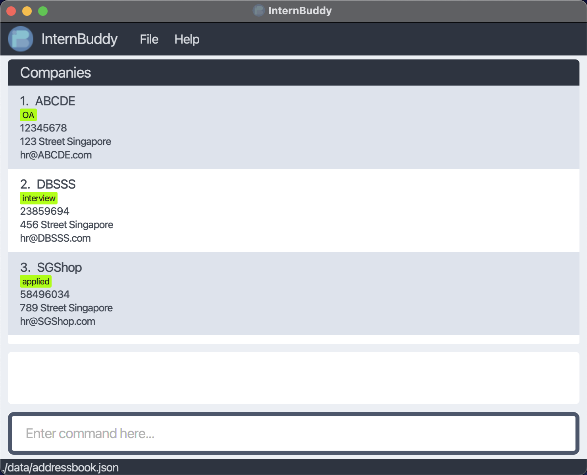 |
    | :--------------------------------------: |
    |             InternBuddy app              |

5. Type the command in the command box and press Enter to execute it. e.g. typing `help` and pressing Enter will open the help window.<br>
   Some example commands you can try:

    - `listc` : Lists all companies.

    - `addc n/DeeBee p/98765432 e/dbs@example.com a/14 Jurong Street #01-01` : Adds a company named `DeeBee` to the list of companies.

    - `delete 3` : Deletes the 3rd contact shown in the currently displayed list.

    - `delete_all` : Deletes all entries in the currently displayed list.

    - `exit` : Exits the app.

    <div markdown="span" class="alert alert-primary">:bulb: **Tip:**
        If you currently do not understand the commands above, don't worry! This is section is for you to install and get the feel for the application.
    </div>

6. If this is your first time reading our user guide, you can refer to the [Overview](#3-overview-of-internbuddy) section
   to learn more about the app, or to the [Features Guide](#4-features-guide) section to better understand the [Features Details](#5-features-details)
   section of the app.

---

## 3. Overview of InternBuddy

**InternBuddy** is specially designed for Computer Science Students who are searching for internships. With **InternBuddy**, there is no need
for you to juggle between multiple apps just to manage your multiple internship applications. 

This app values your
**Time** and **Experience** by placing efficiency as one of its core principles. Let InternBuddy help you manage your
internship application details so you can focus on acing your assessments and interviews!

This section will go into detail as to how the application works.

### 3.1. User Interface 
**In short, what you see!**

When you first open InternBuddy, InternBuddy will present you with:

| 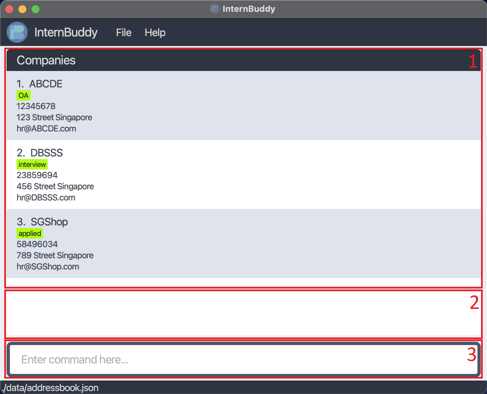 |
| :------------------------------------------------------------: |
|            Main interface components of InternBuddy            |

As you can see in the image above, there are 3 main components of InternBuddy:

1. #### Entry List

    InternBuddy's **Entry List** is a scrollable list containing entries which is explained in [Structure of InternBuddy](#32-structure-of-internbuddy). At the top of the Entry List, you can see the type of entry that is currently displayed.

2. #### Dialog Box

    **The Dialog Box** is where InternBuddy gives you the details of the commands that you have entered. More on this in [Dialog Box](#332-dialog-box)

    <div markdown="span" class="alert alert-primary">:bulb: **Tip:**
        After you type and enter any commands to InternBuddy, the details of the command will be given in The Dialog Box. 
        From here, you can know whether your command is successfully entered or not!
    </div>

4. #### Command Box
    This is where you can input commands to InternBuddy by typing them and then pressing enter. This is the main way of [interacting with **InternBuddy**](#33-interacting-with-the-app).

### 3.2. Structure of InternBuddy

Because internships and job seeking is InternBuddy's main focus, the app supports 3 kinds of entries:

-   **Company**: Represents a company that you are applying for, or will be applying for.
-   **Person**: Represents a contact person of a company. The contact person may have a specific role such as being an HR recruiter.
-   **Event**: Represents an event of a company. An event can be an online assessment, an interview, a job fair, etc.

With that, InternBuddy stores 3 entry lists, one for each entry type:

-   **[Company List](#321-company-list)**
-   **[Person List](#322-person-list)**
-   **[Event List](#323-event-list)**

The app will only display one of these lists at any time, as shown in the screenshots of each of these lists. Lists cannot
have duplicate entries; the criteria for what counts as a duplicate entry will be listed in the sections below.

Each of these 3 entry types have different attributes attached to them. Let's dive in to understand what attributes each
entry type can store.

#### 3.2.1. Company List

|  |
| :----------------------------------------: |
|        Entry list showing companies        |

A **Company** entry has:

-   A _name_
-   An _email address_
-   A _phone number_
-   A _real-life address_
-   Zero or more _tags_ associated with them

**Two Company entries are considered duplicates of each other if they have the same name.**

#### 3.2.2. Person List

|  |
| :---------------------------------------: |
|        Entry list showing contacts        |

A **Person** entry has:

-   A _name_
-   The _name_ of the Company the Person is associated with
-   An _email address_
-   A _phone number_
-   Zero or more _tags_ associated with them

**Two Person entries are considered duplicates of each other if they have the same name.**

#### 3.2.3. Event List

|  |
| :--------------------------------------: |
|        Entry list showing events         |

Finally, an **Event** entry has:

-   A _name_
-   The _name_ of the Company the Event is associated with
-   A _date_
-   A _time_
-   A _location_
-   Zero or more _tags_ associated with them

**Two Event entries are considered duplicates of each other if they have the same name, date, time, and company name.**

### 3.3. Interacting with the app

Since InternBuddy is designed to be used via a Command Line Interface (CLI), you will be interacting with the app mostly through the Command Box by **typing commands in the Command Box** and **hitting the Enter key** afterwards.<br/>

|  |
| :----------------------------------------------: |
|            InternBuddy's Command Box             |

#### 3.3.1. Commands

Commands are sequences of words that follows a predetermined [format](#41-command-formats) that informs InternBuddy what to do.

InternBuddy's commands follows a simple classification system for all 3 lists. There are 5 types of commands:

- **Adding entries**
    -   [`addc`](#521-adding-a-company-addc): Adds a company to the list of companies.
    -   [`addp`](#522-adding-a-person-addp): Adds a person to the list of persons.
    -   [`adde`](#523-adding-an-event-adde): Adds an event to the list of events.
- **Listing/Viewing entries**
    -   [`listc`](#531-listing-all-companies--listc): Lists all companies.
    -   [`listp`](#532-listing-all-persons--listp): Lists all persons.
    -   [`liste`](#533-listing-all-events--liste): Lists all events.
- **Sorting entries**
    -   [`sortc`](#561-sorting-companies-by-name-sortc): Sorts companies by name.
    -   [`sortp`](#562-sorting-people-by-name-sortp): Sorts persons by name.
    -   [`sorte`](#563-sorting-events-by-date-sorte): Sorts events by date.
- **Editing entries**
    -   [`editc`](#541-editing-a-company--editc): Edits a company.
    -   [`editp`](#542-editing-a-person--editp): Edits a person.
    -   [`edite`](#543-editing-an-event--edite): Edits an event.
- **Archiving entries**
    -   [`archive`](#571-archiving-an-entry-archive): Archives an entry.
    -   [`archive_all`](#572-archiving-all-entries-in-display-archive_all): Archives all entries in the display.
    -   [`unarchive`](#573-unarchiving-an-entry-unarchive): Unarchives an entry.
    -   [`unarchive_all`](#574-unarchiving-all-entries-in-display-unarchive_all): Unarchives all entries in the display.
- **Deleting entries**
    -   [`delete`](#581-deleting-an-entry--delete): Deletes an entry.
    -   [`delete_all`](#582-deleting-all-entries-in-display--delete_all): Deletes all currently displayed entries.
    -   [`clear`](#583-clearing-all-entries--clear): Clears all entries.
- **Finding/Locating entries**
    - [`findc`](#551-locating-companies-findc): Finds a company.
    - [`findp`](#552-locating-people-findp): Finds a person.
    - [`finde`](#553-locating-events-finde): Finds an event.
- **Miscellaneous**
    - [`help`](#511-viewing-help--help): Open the help window which contains the link to this User Guide.
    - [`clear`](#583-clearing-all-entries--clear): Delete all entries from all lists.
    - [`exit`](#59-exiting-the-program--exit): Exit and close the application.

You can try clicking on the commands above to see how to use them in further details. However, we would suggest you to
read the [Features Guide](#4-features-guide) section first to have a smoother
experience reading our [Features Details](#5-features-details) section :smile:.

#### 3.3.2. Dialog Box

For those of you not familiar with what a dialog box is, a dialog box is a box that shows when you execute a command. It is a box that contains a message. The message is basically a feedback from InternBuddy to you. InternBuddy will show you a dialog box when you execute a command.

If the command you tried to execute is **invalid** for whatever reason, an **error message** will be shown and the command you typed will remain. An example of this is shown below.

|  |
| :------------------------------------------------------------------: |
|                        Invalid command result                        |

Otherwise, if the command is **valid**, a **success message** will be shown and the command will be executed. The command box will also be cleared.

|  |
| :--------------------------------------------------------: |
|                    Valid command result                    |

### 3.4. Archive

InternBuddy supports archiving entries. When an entry is archived, it will be **"hidden"** from the entry list unless the user
specifically chooses to display them. However, it will still technically
exist in the entry list, and the entry can be unarchived when needed. For example, an Event or Person can still store the company name of an archived Company.

The below screenshot shows what archived entries look like. Notice the `ARCHIVED` tag?

| 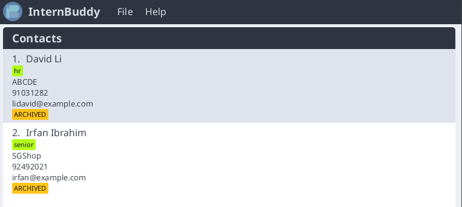 |
| :------------------------------------------------: |
|       Contacts list showing archived entries       |

---

## 4. Features Guide

This section will help you navigate and understand the [Features Details](#5-features-details) section of the guide.
This way, you can easily use it to answer any question you have regarding the app's features.

### 4.1. Command Formats

With a simple command standards, we tried to make the commands as intuitive as possible. To make sure that you can read the commands without any confusion, here are the formats we use in the guide.

<div markdown="block" class="alert alert-info">

**:information_source: Notes about the command format:**<br>

-   Words in `UPPER_CASE` are the parameters to be supplied by the user.<br>
    e.g. in `add n/NAME`, `NAME` is a parameter which can be used as `add n/John Doe`.

-   Items in square brackets are optional.<br>
    e.g `n/NAME [t/TAG]` can be used as `n/John Doe t/friend` or as `n/John Doe`.

-   Items with `…`​ after them can be used multiple times including zero times.<br>
    e.g. `[t/TAG]…​` can be used as ` ` (i.e. 0 times), `t/friend`, `t/friend t/family` etc.

-   Parameters can be in any order.<br>
    e.g. if the command specifies `n/NAME p/PHONE_NUMBER`, `p/PHONE_NUMBER n/NAME` is also acceptable.

-   If a parameter is expected only once in the command but you specified it multiple times, only the last occurrence of the parameter will be taken.<br>
    e.g. if you specify `p/12341234 p/56785678`, only `p/56785678` will be taken.

-   Extraneous parameters for commands that do not take in parameters (such as `help`, `exit` and `clear`) will be ignored.<br>
    e.g. if the command specifies `help 123`, it will be interpreted as `help`.

</div>

### 4.2. Command Parameters

For reference, here is the list of parameters along with the commands that utilize this parameters. We also add a short description of the parameters so you can understand it better :) .

| Parameter                 | Commands | Description                                                                                           |
|----------------------|---------|------------------------------------------------------------------------------------------|
| `n/` | `addc`, `addp`, `adde`, `editc`, `editp`, `edite`, `findc`, `findp`, `finde`  | Name of the entry                                     |
| `c/`               | `adde`, `addp`, `edite`, `editp`, `findp`, `finde`  | Name of the company a person or event related to                                                    |
| `p/`        | `addc`, `addp`, `editc`, `editp`  | Phone number of the person or company |
| `e/`        | `addc`, `addp`, `editc`, `editp`  | Email address of the person or company |
| `a/`        |  `addc`, `editc` | Address of the company |
| `l/`        |  `adde`, `edite`, `finde` | Location of the event |
| `d/`        | `adde`, `edite`  | Date of the event |
| `sd/`        | `finde`  | Start date used to search for events happening at the start date and afterward (inclusive) |
| `ed/`        | `finde`  | End date used to search for events happening at the end date and previously (inclusive) |
| `ti/`        |  `adde`, `edite`, `finde` | Time of the event |
| `s/`        | `listc`, `listp`, `liste`, `findc`, `findp`, `finde`, `sortc`, `sortp`, `sorte`  | Search type used to filter archived, unarchived, or all entries |
| `o/`        | `sortc`, `sortp`, `sorte`  | Orderings used to sort the entries in ascending or descending order |
| `t/`        | `addc`, `addp`, `adde`, `editc`, `editp`, `edite`, `findc`, `findp`, `finde`  | Tags tagged to an entry  |

### 4.3. Command Parameter Restrictions

Some parameters have special restrictions on what counts as a valid input. These restrictions are listed below.
If a parameter is not listed below, it has no special restrictions.

<div markdown="block" class="alert alert-info">
**:information_source: Note:**
An empty input or an input consisting only of spaces is invalid for every parameter 
</div>

-   `n/NAME` - Must only consist of letters or numbers
-   `c/COMPANY_NAME` - Must refer to the name of an existing Company in the app
-   `p/PHONE` - Must contain only numbers and be at least 3 digits long
-   `e/EMAIL` - Must be of the form `local-part@domain`. The `domain` must contain at least one period.
-   `d/DATE`, `sd/START_DATE`, and `ed/END_DATE` - Must be of one of the following forms:
    -   `YYYY-MM-DD` e.g. `2022-01-22` (It must still be a valid date)
    -   `today` (InternBuddy will interpret this as today's date)
    -   `today DAY` e.g. `today 3` (`DAY` should be an integer. InternBuddy will interpret this as `DAY` days after today's date)
-   `ti/TIME` - Must be in `HH:MM` format and be a valid time e.g. `22:40`
-   `s/SEACH_TYPE` - Must be one of `unarchived`, `archived`, or `all`
    -   If no `s/` parameter is given, InternBuddy will default to `unarchived`.
-   `o/ORDERING` - Must be either `ascending` or `descending`
    -   If no `o/` parameter is given, InternBuddy will default to `ascending`.

<div markdown="span" class="alert alert-primary">:bulb: **Tip:**
For the `DATE`, `START_DATE`, and `END_DATE` parameters, the keyword `today` is case-insensitive.
</div>

If a parameter violates these restrictions, an error message will appear
in the Dialog Box. An example of this is shown below.

|      |
| :------------------------------------------------------: |
| Error message in the dialog box after an invalid command |

### 4.4. That's all for the Basic!

And that's all there is to it! Now that you have a basic understanding of the commands, You can now get started on
learning all the important [commands](#5-features-details) you can use to organize your InternBuddy lists. If you have any trouble,
do refer back to the user guide and the [FAQ](#7-faq) section. Good luck! :confetti_ball: :confetti_ball: :confetti_ball:

---

## 5. Features Details

Our InternBuddy has a number of features that you can use to organize your InternBuddy lists. These features follow a certain command format. If you haven't read it, please refer to the [User Guide Icons](#14-helping-icons) and [Command Formats](#41-command-formats) section first. If you are still confused, please refer to the [FAQ](#7-faq) section. Otherwise, you can start using the features listed below. :smile:

<div markdown="span" class="alert alert-primary">:bulb: **Tip:**
Read the <a href="#8-glossary">Glossary</a> section to find some uncommon or niche words in the user guide.
</div>

### 5.1. Getting help

#### 5.1.1. Viewing help : `help`

Shows a message explaining how to access the help page.

|  |
| :-------------------------------------: |
|           Help message window           |

Format:

```
help
```

### 5.2. Adding entries

<div markdown="span" class="alert alert-primary">:bulb: **Tip:**
Adding an entry may fail and display an error message if the entry already exists. You can try to do `listc s/all`/`listp s/all`/`liste s/all`
to see all the entries (archived and unarchived) in the display. This way, you can check if the entry already exists.
</div>

#### 5.2.1. Adding a company: `addc`

Adds a company to the list of companies.

Format:

```
addc n/NAME p/PHONE_NUMBER e/EMAIL a/ADDRESS [t/TAG]…​
```

<div markdown="span" class="alert alert-primary">:bulb: **Tip:**
Entries can have any number of tags (including 0)
</div>

Examples:

- `addc n/Shopee p/96113432 e/shopee@gmail.com a/14 Jurong Street #01-01`
- `addc n/DBS t/bank e/dbs@protonmail.com p/1234567 a/31 Race Card Road #02-03 t/financial`
- `addc n/Company e/company@gmail.com p/91142678 a/ 123 Race Course Road` (see screenshot below)

| 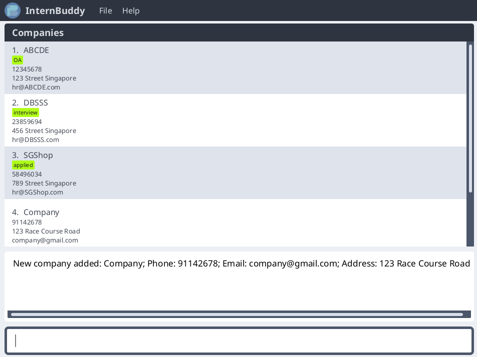 |
| :--------------------------------------------------: |
|            Successfully adding a company             |

#### 5.2.2. Adding a person: `addp`

Adds a person to the list of contact people.

Format:

```
addp n/NAME c/COMPANY_NAME p/PHONE_NUMBER e/EMAIL [t/TAG]…​
```

Examples:

-   `addp n/John Doe c/Shopee p/98765432 e/johnd@example.com`
-   `addp n/Betsy Crowe c/DBS t/friend e/bcrowe@example.com p/1234567 t/hr` (see screenshot below)

| 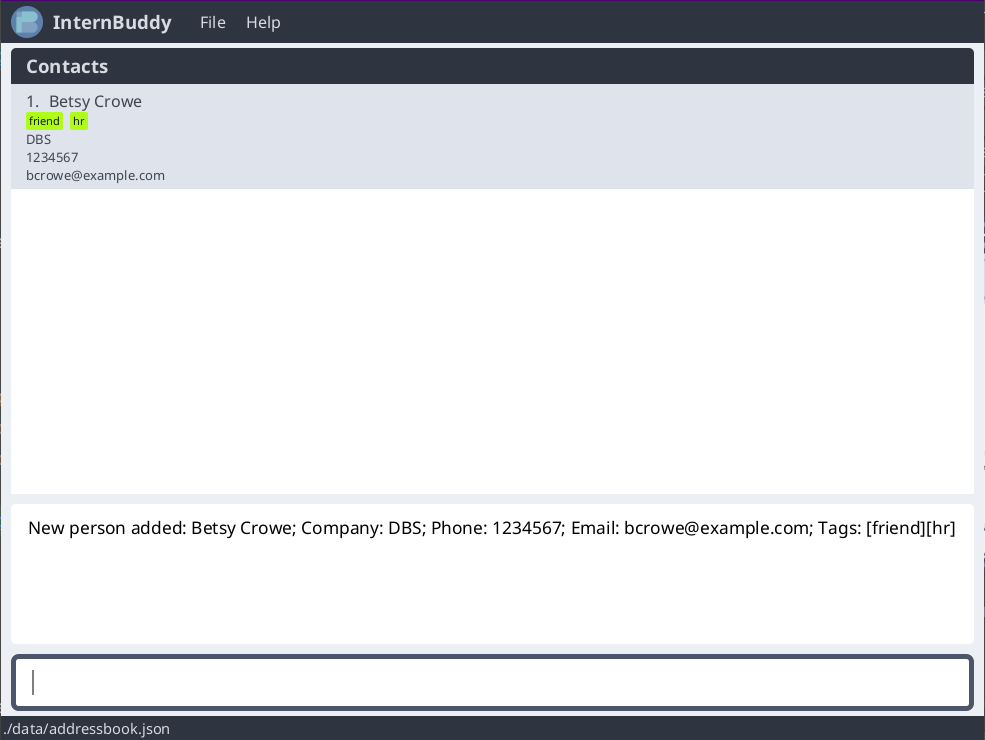 |
| :------------------------------------------------: |
|            Successfully adding a person            |

#### 5.2.3. Adding an event: `adde`

Adds an event to the list of events.

Format:

```
adde n/NAME c/COMPANY_NAME d/DATE ti/TIME l/LOCATION [t/TAG]…​
```

Examples:

-   `adde n/Interview c/DBS d/2022-04-02 ti/14:00 l/Zoom` (see screenshot below)
-   `adde n/Career Talk ti/10:00 d/2022-03-19 c/Sony t/important l/22 Clementi Rd`
-   `adde n/Practical Test c/ABC d/today ti/15:00 l/Zoom`

| 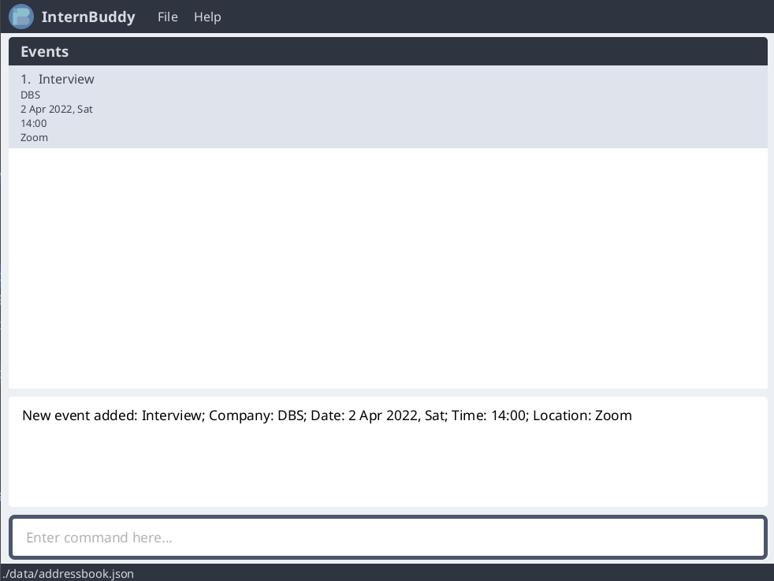 |
| :----------------------------------------------: |
|           Successfully adding an event           |

### 5.3. Listing entries

#### 5.3.1. Listing all companies : `listc`

Shows a list of all companies in the list of companies.

Format:

```
listc [s/SEARCH_TYPE]
```

Examples:

-   `listc` (defaults to `s/unarchived`) displays all unarchived companies (see screenshot below).
-   `listc s/archived` displays all archived companies.

|  |
| :----------------------------------------: |
|      Listing all unarchived companies      |

#### 5.3.2. Listing all persons : `listp`

Shows a list of all people in the list of contact people.

Format:

```
listp [s/SEARCH_TYPE]
```

Examples:

-   `listp` (defaults to `s/unarchived`) displays all unarchived people (see screenshot below).
-   `listp s/archived` displays all archived people.

|  |
| :----------------------------------------: |
|       Listing all unarchived people        |

#### 5.3.3. Listing all events : `liste`

Shows a list of all events in the list of events.

Format:

```
liste [s/SEARCH_TYPE]
```

Examples:

-   `liste` (defaults to `s/unarchived`) displays all unarchived events (see screenshot below).
-   `liste s/archived` displays all archived events.

|  |
| :---------------------------------------: |
|       Listing all unarchived events       |

### 5.4. Editing entries

<div markdown="block" class="alert alert-info">

**:information_source: Notes about the Edit Commands:**<br>

-   Each edit command identifies the entry to edit based on the `INDEX`.
-   The index refers to the index number shown in the appropriately displayed list. For example, for the `editp` command, the index refers to the index in the displayed person list.
-   The index **must be a positive integer** 1, 2, 3,...
-   At least one parameter aside from `INDEX` must be provided.
-   For the parameters not included in the edit command, the values stored for those parameters will remain the same.
-   When editing tags, the existing tags of the entry will be removed i.e adding of tags is not cumulative.
-   **When using the command `editc`, `editp`, or `edite`, the command will not work unless the respective list of entries is displayed (i.e. `editc` works after `listc` or `findc` or `sortc` command)**.

</div>

<div markdown="span" class="alert alert-primary">:bulb: **Tip:**
You can remove all of an entry’s tags by typing `t/` without specifying any tags after it.
</div>

#### 5.4.1. Editing a company : `editc`

Edits an existing company in the list of companies.

Format:

```
editc INDEX [n/NAME] [p/PHONE] [e/EMAIL] [a/ADDRESS] [t/TAG]…
```

<div markdown="span" class="alert alert-warning">:exclamation: **Caution:**
If the name of a Company is edited, all Events and Persons referring to that Company will also
update the company name they have stored.
</div>

Examples:

-   `editc 1 p/91234567 e/company@example.com` edits the phone number and email address of the 1st company to be `91234567` and `company@example.com` respectively (see screenshot below).
-   `editc 2 n/Shoppee t/` edits the name of the 2nd company to be `Shoppee` and clears all existing tags.

| 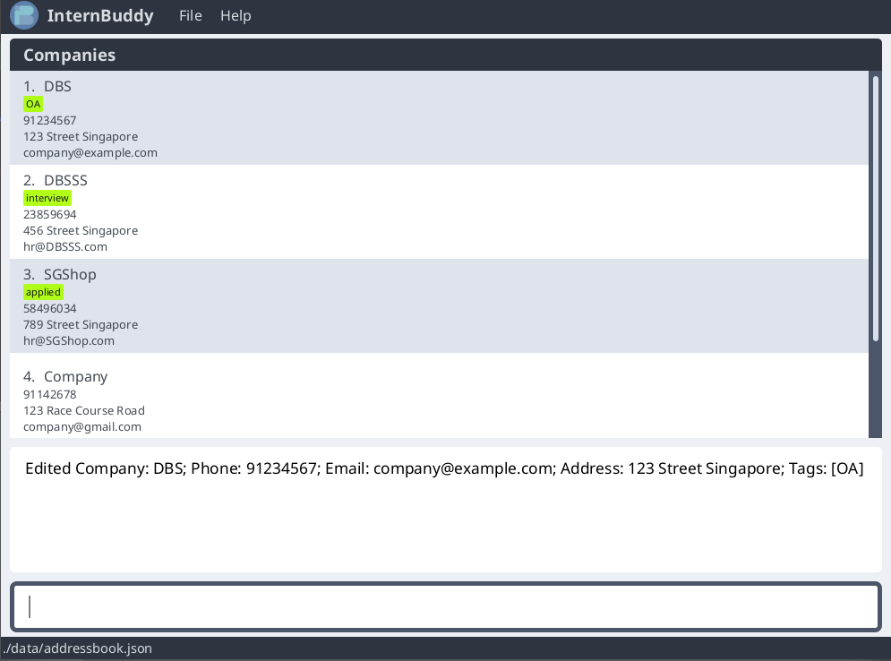 |
| :-------------------------------------------------: |
|           Successfully editing a company            |

#### 5.4.2. Editing a person : `editp`

Edits an existing person in the list of contact people.

Format:

```
editp INDEX [n/NAME] [c/COMPANY_NAME] [p/PHONE] [e/EMAIL] [t/TAG]…​
```

Examples:

-   `editp 1 p/91234567 e/johndoe@example.com` edits the phone number and email address of the 1st person to be `91234567` and `johndoe@example.com` respectively (see screenshot below).
-   `editp 2 n/Betsy Crower t/` edits the name of the 2nd person to be `Betsy Crower` and clears all existing tags.

| 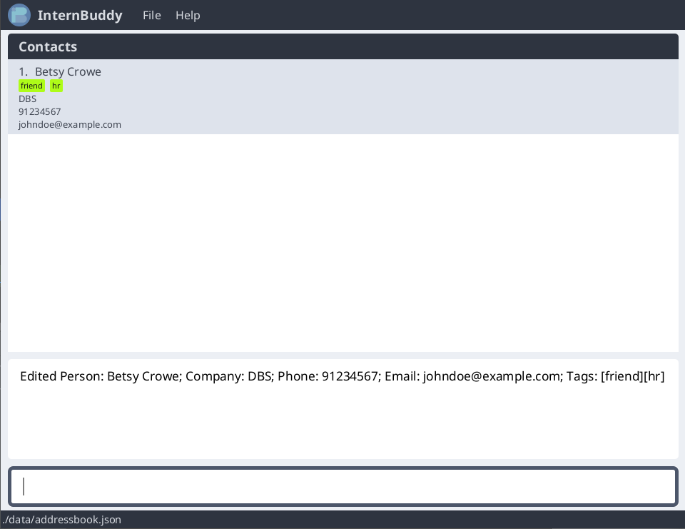 |
| :-----------------------------------------------: |
|           Successfully editing a person           |

#### 5.4.3. Editing an event : `edite`

Edits an existing event in the list of events.

Format:

```
edite INDEX [n/NAME] [c/COMPANY_NAME] [d/DATE] [ti/TIME] [l/LOCATION] [t/TAG]…
```

Examples:

-   `edite 1 d/2021-12-21 l/Zoom` edits the date and location of the 1st event to be `2021-12-21` and `Zoom` respectively.
-   `edite 2 n/Resume Screening t/` edits the name of the 2nd event to be `Resume Screening` and clears all existing tags.

| 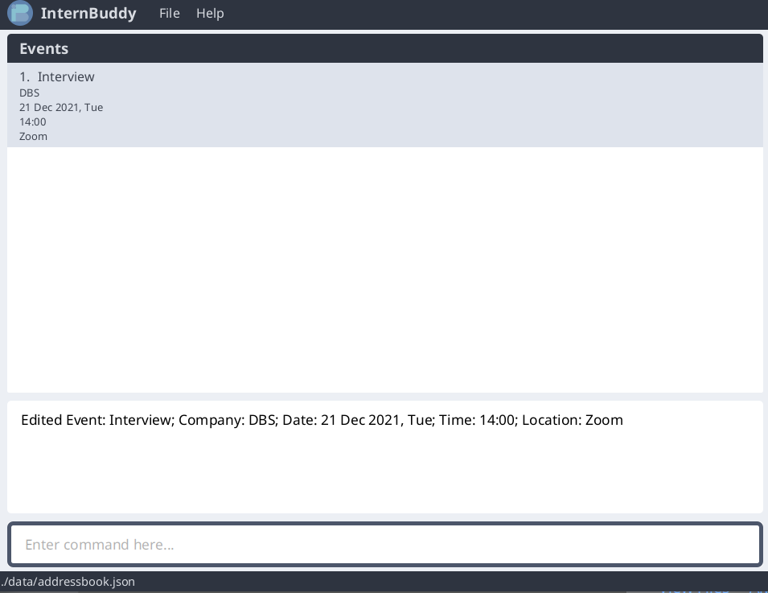 |
| :----------------------------------------------: |
|          Successfully editing an event           |

### 5.5. Locating entries

-   The search is case-insensitive. e.g `hans` will match `Hans`
-   The order of the keywords does not matter. e.g. `findp n/Hans Bo` is the same as `findp n/Bo Hans`
-   Only full words will be matched e.g. `findp n/Han` will not match a Person with the name `Hans`
-   Entries matching at least one keyword will be returned (i.e. `OR` search).
    e.g. `findp n/Hans Bo` will return `Hans Gruber`, `Bo Yang`
-   At least one of the parameters must be provided.

#### 5.5.1. Locating companies: `findc`

Finds all companies which have a name and tags that contain any of the given keywords and displays them as a list
with index numbers.

Format:

```
findc [n/NAME] [s/SEARCH_TYPE] [t/TAG]…
```

Examples:

-   `findc n/sgshop dbsss` returns `SGShop` and `DBSSS` (see screenshot below)
-   `findc n/Shopee` returns `Shopee` and `Shopee Express`
-   `findc n/abc google` returns `Google`, `ABC Pte`<br>

|  |
| :-------------------------------------------------: |
|       Finding a company named sgshop and dbss       |

#### 5.5.2. Locating people: `findp`

Finds all persons whose name, company name, and tags contain any of the given keywords and displays them as a list
with index numbers.

Format:

```
findp [n/NAME] [c/COMPANY_NAME] [s/SEARCH_TYPE] [t/TAG]…
```

Examples:

-   `findp n/John` returns `john` and `John Doe`
-   `findp n/alex david` returns `Alex Yeoh`, `David Li` (see screenshot below)<br>

|  |
| :-------------------------------------------------------------: |
|           Finding alex and david in the contact list            |

#### 5.5.3. Locating events: `finde`

Finds all events whose name, company, start date, end date, time, location and tags contains the specified keywords
and displays them as a list with index numbers.

<div markdown="span" class="alert alert-primary">:information_source: **Note:**
START DATE and END DATE will find events from the START DATE to the END DATE **inclusively**.
</div>

Format:

```
finde [n/NAME] [c/COMPANY_NAME] [sd/START_DATE] [ed/END_DATE] [ti/TIME] [l/LOCATION] [s/SEARCH_TYPE] [t/TAG]…
```

Examples:

-   `finde n/online` returns `online interview` and `online assessment`
-   `finde s/all n/online` returns `online interview`, `online assessment`, `online assessment`
-   `finde s/archived n/test` returns `software test`, `practical test`<br> (given both events have been archived)
-   `finde sd/Today ed/2022-05-21` returns all events where the date is between today and 2022-05-21.

|        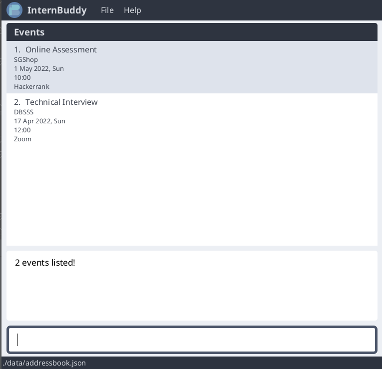         |
| :----------------------------------------------------------: |
| Finding all events between Today (2022-04-15) and 2022-05-21 |

### 5.6. Sorting entries

<div markdown="block" class="alert alert-info">

**:information_source: Notes about the Sort Commands:**<br>

-   Sort commands will sort the entry list in a certain order and display it
-   The entry list that is displayed and sorted depends on the sorting command used
</div>

Below are screenshots of sorting the company list in ascending order (above) and descending order (below).

| 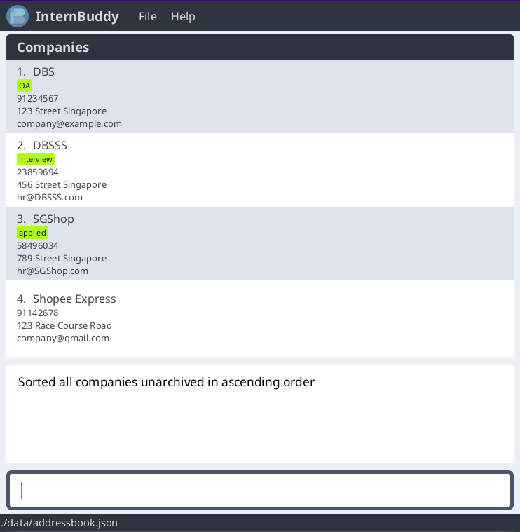 |
| :---------------------------------------------------: |
|      Sorting the company list in ascending order      |

| 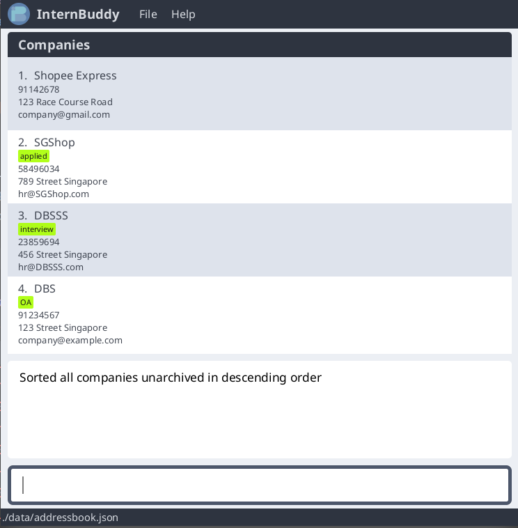 |
| :-----------------------------------------------------: |
|       Sorting the company list in desceding order       |

#### 5.6.1. Sorting companies by name: `sortc`

Sorts companies by name. The default is in `ascending` order. To sort in `descending` order, use `sortc o/descending`.

Format:

```
sortc [s/SEARCH_TYPE] [o/ORDERING]
```

Examples:

-   `sortc` returns all unarchived companies in ascending order (see screenshot below)
-   `sortc o/descending` returns all unarchived companies in descending order
-   `sortc s/all o/descending` returns all companies in descending order

#### 5.6.2. Sorting people by name: `sortp`

Sorts people by name. The default is in `ascending` order. To sort in `descending` order, use `sortp o/descending`.

Format:

```
sortp [s/SEARCH_TYPE] [o/ORDERING]
```

Examples:

-   `sortp` returns all unarchived people in ascending order
-   `sortp o/descending` returns all unarchived people in descending order
-   `sortp s/all o/descending` returns all people in descending order

#### 5.6.3. Sorting events by date: `sorte`

Sorts events by date. The default is in `ascending` order. To sort in `descending` order, use `sorte o/descending`.

Format:

```
sorte [s/SEARCH_TYPE] [o/ORDERING]
```

Examples:

-   `sorte` returns all unarchived events in ascending order
-   `sorte o/descending` returns all unarchived events in descending order
-   `sorte s/all o/descending` returns all events in descending order

### 5.7. Archiving entries

<div markdown="block" class="alert alert-info">

**:information_source: Notes about the Archive Commands:**<br>

-   Archived entries will be "hidden" from their entry list unless the user specifically searches for them
    (e.g. by using the `s/archived` or `s/all` parameter)
-   Only unarchived entries can be archived; similarly, only archived entries can be unarchived.

</div>

#### 5.7.1. Archiving an entry: `archive`

Archives an entry in the currently displayed list.

Format:

```
archive INDEX
```

Examples:

-   `archive 1` archives the 1st entry in the currently displayed list.

<div markdown="span" class="alert alert-primary">:bulb: **Tip:**
Use a list, find, or sort command to get all unarchived entries first. That way, you can get the INDEX of the entry
you want to archive.
</div>

|         |
| :----------------------------------------------------------: |
| Archived DBS, the first entry on the previous displayed list |

#### 5.7.2. Archiving all entries in display: `archive_all`

Archiving all the entries displayed in the currently displayed list.

Format:

```
archive_all
```

| 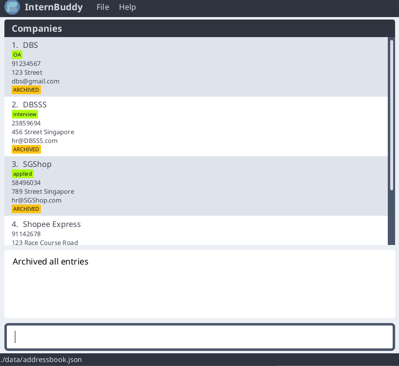 |
| :----------------------------------------------------: |
|       Archived all entries on the displayed list       |

#### 5.7.3. Unarchiving an entry: `unarchive`

Unarchiving an entry will show it in the list of entries.

Format:

```
unarchive INDEX
```

|      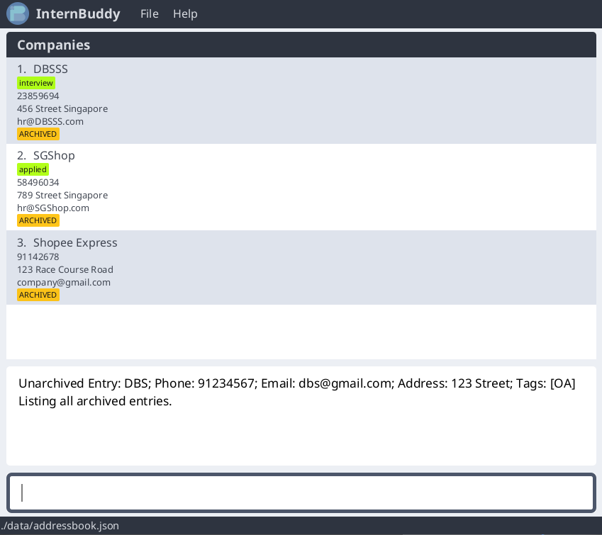      |
| :-----------------------------------------------------------------: |
| DBS not showing in the archived company list after being unarchived |

Examples:

-   `unarchive 1` shows the 1st entry in the list of entries.

<div markdown="span" class="alert alert-primary">:bulb: **Tip:**
Use a list, find, or sort command to get all archived entries first. That way, you can get the INDEX of the entry
you want to unarchive.
</div>

#### 5.7.4. Unarchiving all entries in display: `unarchive_all`

Unarchiving all the entries displayed in the currently displayed list.

Format:

```
unarchive_all
```

|   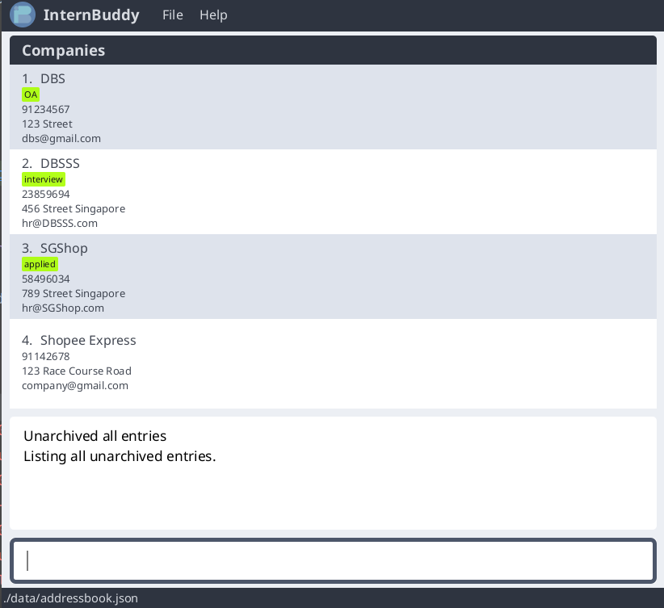    |
| :-----------------------------------------------------------: |
| All recently unarchived entries visible in the companies list |

### 5.8. Removing entries

#### 5.8.1. Deleting an entry : `delete`

Deletes the specified entry from the currently displayed list.

Format:

```
delete INDEX
```

-   Deletes the entry at the specified `INDEX` of the currently displayed list.
-   The index refers to the index number shown in the currently displayed list.
-   The index **must be a positive integer** 1, 2, 3, …​

<div markdown="span" class="alert alert-warning">:exclamation: **Caution:**
When a Company is deleted, all Persons and Events which store the company name of that Company will also be deleted.
</div>

Examples:

-   `listc` followed by `delete 2` deletes the 2nd company in the list of comapnies.
-   `findp Betsy` followed by `delete 1` deletes the 1st person in the results of the `find` command.

|   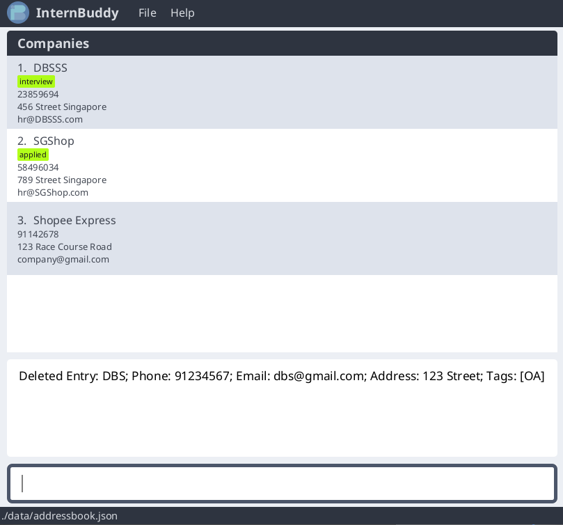    |
| :-------------------------------------------------------: |
| DBS not showing in the companies list after being deleted |

#### 5.8.2. Deleting all entries in display : `delete_all`

Deletes all the entries displayed in the currently displayed list.

Format:

```
delete_all
```

|                        |
| :------------------------------------------------------------------------: |
| Empty list of events after using `delete_all` on the displayed events list |

#### 5.8.3. Clearing all entries : `clear`

Clears all entries from all lists.

Format:

```
clear
```

|                   |
| :------------------------------------------------: |
| Empty list of companies after clearing all entries |

### 5.9. Exiting the program : `exit`

Exits the program.

Format:

```
exit
```

### 5.10. Saving the data

InternBuddy data are saved in the hard disk automatically after any command that changes the data. There is no need to save manually.

### 5.11. Editing the data file

<div markdown="span" class="alert alert-info">:information_source: **Note:** This section is for advanced users only.
</div>

InternBuddy data are saved as a JSON file `[JAR file location]/data/internbuddy.json`. Advanced users are welcome to update data directly by editing that data file.

<div markdown="span" class="alert alert-warning">:exclamation: **Caution:**
If your changes to the data file makes its format invalid, InternBuddy will discard all data and start with an empty data file at the next run.
</div>

---

## 6. That is All!
Congratulations! You have finished reading all InternBuddy has to offer. We the developers surely hope that 
you find this User Guide to be useful as your personal Guide to become **InternBuddy Guru**.

With that, Good Luck with your Internship!

---
## 7. FAQ

**Q**: How do I transfer my data to another Computer?<br>
**A**: Install the app in the other computer and overwrite the empty data file it creates with the file that contains the data of your previous InternBuddy home folder.

**Q**: Is InternBuddy development still in progress?<br>
**A**: Yes! InternBuddy is an active ongoing project. We hope to optimise the application to better suit our user!

---

## 8. Glossary

-   ### CLI
    CLI stands for Command Line Interface. It is a special type of terminal where you can type commands into it and the command will be executed.
-   ### GUI
    GUI stands for Graphical User Interface. Contrary to CLI, GUI is an interface that you can interact with, mainly through clicking interface (i.e. clicking buttons).
-   ### Entry
    An entry is a single entry in a list. In InternBuddy, an entry can be a company, a person, or an event. Entry is a generic term that can be used to refer to any of the three types of entries.
-   ### Parameter
    A parameter is a keyword that is used to specify a specific action. For example, `listc` is a command that lists all companies. `listc` has a parameter `s/` that specifies the type of entries to be listed.

---

## 9. Command summary

| Action                       | Format                                                                                                          | Examples                                                                        |
| ---------------------------- | --------------------------------------------------------------------------------------------------------------- | ------------------------------------------------------------------------------- |
| **Add Company**              | `addc n/NAME p/PHONE_NUMBER e/EMAIL a/ADDRESS [t/TAG]… `                                                        | `addc n/DBS t/bank e/dbs@example.com p/1234567 a/31 Race Road #02-03 t/finance` |
| **Add Person**               | `addp n/NAME c/COMPANY_NAME p/PHONE_NUMBER e/EMAIL [t/TAG]… `                                                   | `addp n/John Doe c/Shopee p/98765432 e/johnd@example.com t/friend t/colleague`  |
| **Add Event**                | `adde n/NAME c/COMPANY_NAME d/DATE ti/TIME l/LOCATION [t/TAG]… `                                                | `adde n/Career Talk c/Sony d/2022-03-19 ti/10:00 l/22 Clementi Rd t/important`  |
| **Archive**                  | `archive INDEX`                                                                                                 | `archive 2`                                                                     |
| **Archive all in display**   | `archive_all`                                                                                                   |                                                                                 |
| **Clear**                    | `clear`                                                                                                         |                                                                                 |
| **Delete**                   | `delete INDEX`                                                                                                  | `delete 3`                                                                      |
| **Delete all in display**    | `delete_all`                                                                                                    |                                                                                 |
| **Edit Company**             | `editc INDEX [n/NAME] [p/PHONE] [e/EMAIL] [a/ADDRESS] [t/TAG]…`                                                 | `editc 2 n/Shoppee t/`                                                          |
| **Edit Person**              | `editp INDEX [n/NAME] [c/COMPANY_NAME] [p/PHONE] [e/EMAIL] [t/TAG]…`                                            | `editp 1 p/91234567 e/johndoe@example.com`                                      |
| **Edit Event**               | `edite INDEX [n/NAME] [c/COMPANY_NAME] [d/DATE] [ti/TIME] [l/LOCATION] [t/TAG]…`                                | `edite 2 n/Resume Screening d/2022-12-11`                                       |
| **Exit**                     | `exit`                                                                                                          |                                                                                 |
| **Find Company**             | `findc [n/NAME] [s/SEARCH_TYPE] [t/TAG]…`                                                                       | `findc s/unarchived n/Shopee`                                                   |
| **Find Person**              | `findp [n/NAME] [c/COMPANY_NAME] [s/SEARCH_TYPE] [t/TAG]…`                                                      | `findp n/James Jake`                                                            |
| **Find Event**               | `finde [n/NAME] [c/COMPANY_NAME] [sd/START_DATE] [ed/END_DATE] [ti/TIME] [l/LOCATION] [s/SEARCH_TYPE] [t/TAG]…` | `finde s/all n/Career Talk sd/2022-01-01 ed/2022-03-14`                         |
| **Help**                     | `help`                                                                                                          |                                                                                 |
| **List Companies**           | `listc [s/SEARCH_TYPE]`                                                                                         | `listc`                                                                         |
| **List Persons**             | `listp [s/SEARCH_TYPE]`                                                                                         | `listp s/all`                                                                   |
| **List Events**              | `liste [s/SEARCH_TYPE]`                                                                                         | `liste s/archived`                                                              |
| **Sort Companies**           | `sortc [s/SEARCH_TYPE] [o/ORDERING]`                                                                            | `sortc`                                                                         |
| **Sort Persons**             | `sortp [s/SEARCH_TYPE] [o/ORDERING]`                                                                            | `sortp s/unarchived o/ascending`                                                |
| **Sort Events**              | `sorte [s/SEARCH_TYPE] [o/ORDERING]`                                                                            | `sortc o/descending s/archived`                                                 |
| **Unarchive**                | `unarchive INDEX`                                                                                               | `unarchive 4`                                                                   |
| **Unarchive all in display** | `unarchive_all`                                                                                                 |                                                                                 |
